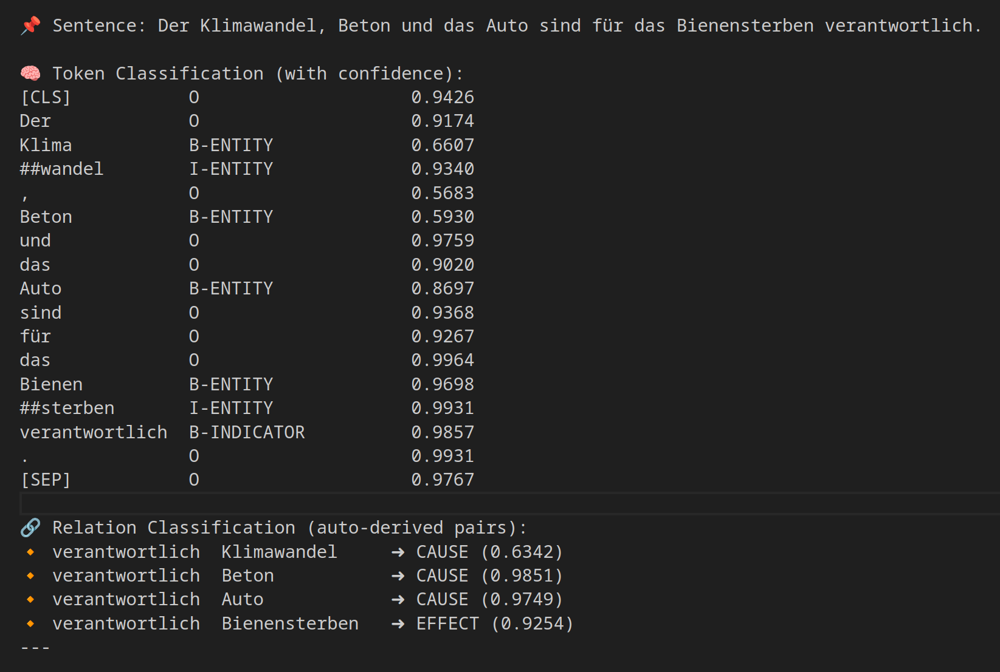

# CausalBERT: A Multi-Task Model for German Causal Relation Extraction

CausalBERT is a natural language processing framework designed to extract causal relationships from German text. Built upon the Transformer architecture, this collection of scripts uses fine-tuned encoder-only models to perform two key tasks:

1.  **Token Classification (Span Recognition)**: Identifying and labeling causal indicators and entities within a sentence (e.g., "B-INDICATOR", "I-ENTITY").
2.  **Relation Classification**: Determining the causal relationship (CAUSE, EFFECT, INTERDEPENDENCY, or NO_RELATION) between a given indicator and entity pair within a sentence.



This repository contains the code to create datasets, train and run inference. A prototype [model]([here](https://huggingface.co/norygano/CBERT)) trained on German Environmental Texts aims to demonstrate the framework's capabilities.

## Features

* **Multi-Task Learning**: Jointly trains on token classification and relation classification tasks for improved performance.
* **German Language Support**: Leverages the `EuroBERT/EuroBERT-2.1B` base model, making it suitable for German text.
* **Custom Token Handling**: Incorporates a special `<|parallel_sep|>` token for effective handling of multi-part inputs in relation classification.
* **Flexible Data Preparation**: Includes a robust script for preparing datasets from raw JSON, handling tokenization, and BIO (Beginning, Inside, Outside) labeling.
* **Weighted Loss**: Dynamically calculates and applies class weights during training to address potential class imbalance in both token and relation datasets.
* **Inference Capabilities**: Provides functions for predicting token labels, relation labels, batch predictions, and comprehensive sentence analysis.
* **Embedding Analysis**: Offers a utility to analyze token embedding trajectories across layers, useful for model interpretability.

## Installation

To set up the environment, clone the repository and install the package using pip:

```bash
git clone [https://github.com/norygami/CausalBERT.git](https://github.com/norygami/CausalBERT.git)
cd CausalBERT
pip install .
````

This will install all necessary dependencies specified in `setup.py`.

For SpaCy, if you plan to use dependency parsing during dataset creation, download the German model:

```bash
python -m spacy download de_core_news_trf
```

## Project Structure

```
causalbert/
├── train.py                # Script for training the CausalBERT model
├── model.py                # Defines the CausalBERTMultiTaskModel and its configuration
├── infer.py                # Provides functions for inference and analysis
├── dataset.py              # Script for preparing the token and relation classification datasets
├── data/
│   ├── input/
│   │   └── json/
│   │       └── all_sentences.json # Raw input data for dataset creation (example location)
│   └── dataset/
│       ├── base/           # Processed datasets (without dependency parsing)
│       │   ├── token/
│       │   │   ├── train/
│       │   │   └── test/
│       │   └── relation/
│       │       ├── train/
│       │       └── test/
│       └── dep/            # Processed datasets (with dependency parsing - optional)
│           ├── token/
│           │   ├── train/
│           │   └── test/
│           └── relation/
│               ├── train/
│               └── test/
│   └── model/              # Directory for saving trained models
│       └── CausalBERT_EuroBERT/ # Example saved model directory
│           ├── config.json
│           ├── model.safetensors
│           └── tokenizer.json
README.md               # This file
LICENSE                 # Apache License 2.0 text
.gitignore              # Git ignore file
pyproject.toml          # Project configuration for build system
setup.py                # Setup script for package installation
MANIFEST.in             # Manifest file for packaging
```

## Usage

### 1\. Data Preparation

Your raw data should be in a JSON file (e.g., `all_sentences.json`).

Run `dataset.py` to process your raw data into token and relation classification datasets. You will need to provide the full path to your input JSON file.

```bash
# Example if all_sentences.json is in a 'data/raw_input' folder within your project:
python -m causalbert.dataset --input_json_path data/raw_input/all_sentences.json --base_dir ./data --model_name "EuroBERT/EuroBERT-2.1B" --debug # Add --dep for dependency parsing

# If your all_sentences.json is directly in 'data/output/inception/json' as in your project structure:
python -m causalbert.dataset --input_json_path data/output/inception/json/all_sentences.json --base_dir ./data --model_name "EuroBERT/EuroBERT-2.1B" --debug
```

**Key Arguments for `dataset.py`:**

  * `--input_json_path`: **(REQUIRED)** The full path to your raw input JSON file (e.g., `data/output/inception/json/all_sentences.json`).
  * `--base_dir`: Base directory for where the processed datasets will be saved (default: `./data`).
  * `--model_name`: The pre-trained model name used for tokenization (e.g., `"EuroBERT/EuroBERT-2.1B"`). **Ensure this matches the `model_name` used in `train.py` and `infer.py`.**
  * `--include_empty`: If set, includes sentences with no relations in the token dataset (default: `False`).
  * `--debug`: Enables debug logging for more detailed output during data processing.
  * `--dep`: If set, performs dependency parsing using SpaCy and includes `upos`, `feats`, and `dep` fields in the token dataset.

The processed datasets will be saved to `data/dataset/base/` or `data/dataset/dep/` (if `--dep` is used) within your `--base_dir`.

### 2\. Training the Model

The `train.py` script orchestrates the training process. It loads the prepared datasets, initializes the CausalBERT model, and fine-tunes it for the specified number of epochs.

```bash
python -m causalbert.train --epochs 5 --batch_size 8 --lr 2e-5 --use_wandb True
```

**Key Arguments for `train.py`:**

  * `--base_dir`: Base directory where datasets are located and models will be saved (default: `../data`).
  * `--model_name`: The base Transformer model to use (default: `"EuroBERT/EuroBERT-2.1B"`).
  * `--model_save_name`: Name for the saved model directory (default: `"CausalBERT_EuroBERT"`).
  * `--epochs`: Number of training epochs (default: `5`).
  * `--batch_size`: Training batch size (default: `8`).
  * `--lr`: Learning rate for the AdamW optimizer (default: `2e-5`).
  * `--device`: Device to use for training (`cuda` or `cpu`). Automatically detected if not specified.
  * `--use_wandb`: Enable Weights & Biases logging (default: `True`).
  * `--gradient_accumulation_steps`: Number of steps for gradient accumulation (default: `4`).

The trained model and tokenizer will be saved to `data/model/{model_save_name}`.

### 3\. Inference and Analysis

The `infer.py` script provides various functions to load your trained model and perform predictions.

#### Loading the Model

```python
from causalbert.infer import load_model

model_dir = "data/model/CausalEuroBERT" # Path to your saved model, assuming run from project root
model, tokenizer, config, device = load_model(model_dir)

print(f"Model loaded on {device}")
```

#### Predicting Token Labels

Given a sentence, predict the BIO labels for each token.

```python
from causalbert.infer import predict_token_labels

sentence = "Der Krieg in der Ukraine verursachte hohe Verluste."
token_labels = predict_token_labels(model, tokenizer, config, sentence, device)
print("Token Labels:", token_labels)
# Example Output: [('Der', 'O'), ('Krieg', 'O'), ('in', 'O'), ('der', 'O'), ('Ukraine', 'O'), ('verursachte', 'B-INDICATOR'), ('hohe', 'O'), ('Verluste', 'B-ENTITY'), ('.', 'O')]
```

#### Predicting Relation Labels

Given a sentence, an indicator, and an entity, predict the causal relation.

```python
from causalbert.infer import predict_relation_label

sentence = "Der Krieg in der Ukraine verursachte hohe Verluste."
indicator = "verursachte"
entity = "hohe Verluste"
relation = predict_relation_label(model, tokenizer, config, sentence, indicator, entity, device)
print(f"Relation between '{indicator}' and '{entity}': {relation}")
# Example Output: Relation between 'verursachte' and 'hohe Verluste': CAUSE
```

#### Batch Prediction of Relations

Predict relations for multiple (indicator, entity, sentence) tuples efficiently.

```python
from causalbert.infer import predict_relations_batch

test_cases = [
    ("verursachte", "hohe Verluste", "Der Krieg in der Ukraine verursachte hohe Verluste."),
    ("Folge", "Krieg", "Als Folge des Krieges stiegen die Preise."),
]
relations_batch = predict_relations_batch(model, tokenizer, config, test_cases, device)
print("Batch Relations:", relations_batch)
```

#### Comprehensive Sentence Analysis with Confidence Scores

Combines token classification and relation classification, providing confidence scores for each prediction. It also includes a utility to merge BIO tags into readable entity spans.

```python
from causalbert.infer import analyze_sentence_with_confidence, merge_bio_entities

sentence = "Der Krieg in der Ukraine verursachte hohe Verluste und führte zu einem Anstieg der Preise."
indicator_entity_pairs = [
    ("verursachte", "hohe Verluste"),
    ("führte zu", "einem Anstieg der Preise")
]

analysis_result = analyze_sentence_with_confidence(model, tokenizer, config, sentence, indicator_entity_pairs, device)

print("\nDetailed Token Analysis:")
for token, label, conf in analysis_result["tokens"]:
    print(f"  Token: '{token}', Label: '{label}', Confidence: {conf:.4f}")

merged_entities = merge_bio_entities(
    [t for t, l, c in analysis_result["tokens"]],
    [l for t, l, c in analysis_result["tokens"]],
    [c for t, l, c in analysis_result["tokens"]]
)
print("\nMerged Entities:")
for entity_text, entity_label, avg_confidence in merged_entities:
    if entity_label is not None:
        print(f"  Span: '{entity_text}', Type: '{entity_label}', Avg Confidence: {avg_confidence:.4f}")

print("\nDetailed Relation Analysis:")
for (indicator, entity), rel_info in analysis_result["relations"]:
    print(f"  Indicator: '{indicator}', Entity: '{entity}', Relation: '{rel_info['label']}', Confidence: {rel_info['confidence']:.4f}")
```

#### Analyzing Token Embedding Trajectories

Visualize how token embeddings change across the layers of the base Transformer model. This can be useful for understanding what information different layers capture.

```python
from causalbert.infer import analyze_token_trajectories

sentence = "Der Krieg in der Ukraine verursachte hohe Verluste."
target_tokens = ["verursachte", "Verluste"] # Optional: analyze specific tokens
embedding_data = analyze_token_trajectories(model, tokenizer, sentence, target_tokens, output_json="embedding_trajectories.json")
print(f"Embedding trajectories saved to embedding_trajectories.json")
```

## Model Architecture (`model.py`)

The `CausalBERTMultiTaskModel` is a custom `PreTrainedModel` built on top of a `Hugging Face AutoModel` (e.g., EuroBERT).

  * **`CausalBERTMultiTaskConfig`**: A custom configuration class inheriting from `PretrainedConfig`, used to store specific parameters for the multi-task model, such as the number of span and relation labels, base model name, and class weights for loss calculation.
  * **Base Model**: The model initializes a `transformers.AutoModel` (e.g., EuroBERT) as its backbone. It supports `torch.bfloat16` and `torch.float16` for efficient computation on compatible hardware.
  * **Task-Specific Heads**:
      * `token_classifier`: A linear layer for token classification (span recognition).
      * `relation_classifier`: A linear layer for relation classification.
  * **Weighted CrossEntropyLoss**: The model dynamically applies class weights for the `CrossEntropyLoss` function in both token and relation classification tasks. These weights are calculated in `train.py` to mitigate class imbalance.
  * **Forward Pass**: The `forward` method directs the input through the base model and then through the appropriate classification head based on the `task` argument ("token" or "relation").

## Dataset Creation (`dataset.py`)

The `dataset.py` script is responsible for transforming raw sentence data into a format suitable for training.

  * **Sentence Cleaning**: Standardizes spaces and punctuation.
  * **Tokenization**: Uses the specified `AutoTokenizer` (e.g., `EuroBERT/EuroBERT-2.1B`) and adds a special `"<|parallel_sep|>"` token if not present.
  * **BIO Labeling**: It robustly assigns BIO (Beginning, Inside, Outside) tags to tokens for span recognition, based on character offsets from the raw text annotations.
  * **Relation Data Formatting**: Prepares data for relation classification by combining indicator, entity, and sentence into a single input sequence, separated by the `<|parallel_sep|>` token.
  * **Class Mapping**: Defines mappings for span labels (`O`, `B-INDICATOR`, `I-INDICATOR`, `B-ENTITY`, `I-ENTITY`) and relation labels (`NO_RELATION`, `CAUSE`, `EFFECT`, `INTERDEPENDENCY`).
  * **Train/Test Split**: Splits the prepared datasets into training and testing sets and saves them to disk using Hugging Face `datasets` library.
  * **Dependency Parsing (Optional)**: Can integrate SpaCy to extract Universal Part-of-Speech (UPOS), morphological features (FEATS), and dependency relations (DEP) for each token, if the `--dep` flag is used.

## Training Process (`train.py`)

The `train.py` script handles the end-to-end training workflow:

  * **Device Setup**: Automatically detects and uses CUDA if available, otherwise falls back to CPU. Supports `bfloat16` and `float16` precision on CUDA-enabled GPUs.
  * **Data Loading**: Loads pre-processed datasets for token and relation tasks from disk.
  * **Class Weight Calculation**: Crucially, it calculates and applies normalized inverse-frequency class weights for both token and relation classification tasks. This helps in training with imbalanced datasets.
  * **Model and Optimizer Initialization**: Initializes `CausalBERTMultiTaskModel` with the calculated weights and `AdamW` optimizer.
  * **Multi-Task Data Loaders**: Creates `DataLoader` instances for both token and relation tasks, using a `MultiTaskCollator` to handle batching and padding.
  * **Training Loop**: Iterates through epochs, alternating between token and relation task loaders to perform multi-task training.
  * **Gradient Accumulation**: Implements gradient accumulation to simulate larger batch sizes, which can be beneficial for training large models or with limited GPU memory.
  * **Mixed Precision Training**: Utilizes `torch.autocast` and `torch.cuda.amp.GradScaler` for mixed-precision training (FP16/BF16) when on CUDA, enhancing training speed and reducing memory usage.
  * **Weights & Biases Integration**: Logs training metrics (loss per task, epoch, global step) to Weights & Biases for monitoring.
  * **Model Saving**: Saves the trained model and tokenizer at the end of training.

## Future Work

  * Add comprehensive evaluation metrics (F1-score, precision, recall) for both tasks.
  * Implement a dedicated evaluation script.
  * Explore different base models and architectures.
  * Extend to other causal relation types or languages.
  * Integrate Hugging Face `Trainer` API for potentially simpler training loops and evaluation.

## Contributing

Contributions are welcome\! Please feel free to open issues or submit pull requests.

## License

This project is licensed under the Apache License 2.0. See the [LICENSE](./LICENSE) file for more details.

**Important Note on Base Models:**
This project utilizes and fine-tunes pre-trained Transformer models from the Hugging Face Hub, specifically `EuroBERT/EuroBERT-2.1B`, which is also licensed under Apache License 2.0. While our code is permissively licensed, **the resulting fine-tuned model (weights and configurations) will inherit the license of the base model it was trained on.** Users are advised to check the specific license of any base model they choose to use with this code to ensure compliance with their intended use cases.
